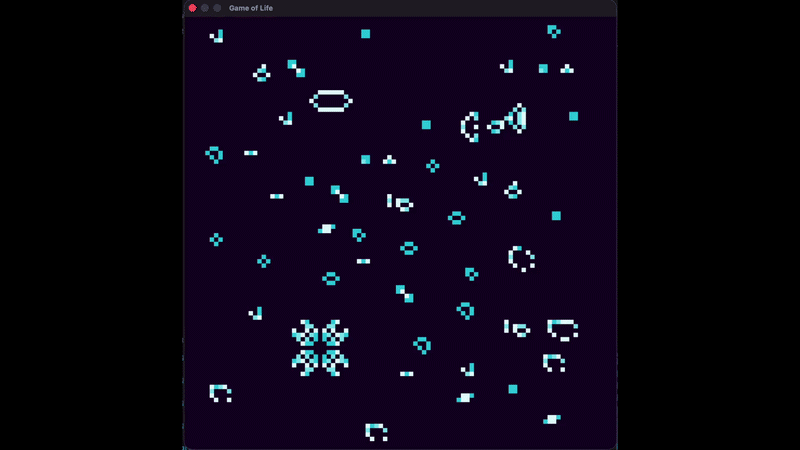

# Conway's Game of Life — Renderizado en tiempo real

Laboratorio de la clase de Gráficas por Computadora: implementación del Juego de la Vida de Conway, renderizado en tiempo real sobre un framebuffer propio y una ventana con [minifb](https://crates.io/crates/minifb).

## Demo



*(Si no ves la imagen arriba, todavía no se subió `demo.gif` a la raíz del repo — ver sección "Grabar el GIF" más abajo.)*

## Qué hace

- Implementa las 4 reglas clásicas de Conway (soledad, supervivencia, sobrepoblación, reproducción) usando únicamente `point` (escritura) y `get_color` (lectura) del framebuffer.
- Bordes **toroidales**: una celda que sale por la derecha reaparece por la izquierda (y lo mismo arriba/abajo), en vez de tratarse como "muerta" — da patrones más interesantes y ninguna nave desaparece al llegar al borde.
- El framebuffer lógico (100×100, una celda = un píxel) es más chico que la ventana (800×800); `minifb` escala uno al otro automáticamente.
- **Coloreado por edad**: las celdas vivas no son solo blanco/negro — arrancan en celeste al nacer y se van oscureciendo hacia morado mientras más turnos sobreviven. Es puramente estético: la regla de "¿está viva?" sigue siendo binaria (`get_color(...) != color_de_fondo`).
- Patrón inicial: **18 organismos distintos** (still lifes, osciladores, naves y un cañón de gliders) repartidos automáticamente por todo el tablero en posiciones pseudo-aleatorias, verificando que ninguno se encime con otro antes de colocarlo.

### Organismos incluidos

| Tipo | Organismos |
|---|---|
| Still lifes | block, beehive, loaf, boat, tub |
| Osciladores | blinker, toad, beacon, pulsar, pentadecathlon |
| Naves (spaceships) | glider, lightweight/middleweight/heavyweight spaceship |
| Gun | Gosper glider gun (dispara un glider nuevo cada 30 turnos, indefinidamente) |
| Methuselahs | R-pentomino, acorn, diehard (muy pocas células, evolución larga y caótica) |

## Estructura

- `src/framebuffer.rs` — buffer de píxeles en memoria (`Vec<u32>`, un color `0xRRGGBB` por píxel). `point(x, y)` pinta con el color activo; `get_color(x, y)` lee el color de una celda.
- `src/life.rs` — el motor de Conway: `step(current, next, current_age, next_age)` calcula un turno completo con bordes toroidales, y la paleta/lógica de coloreado por edad.
- `src/patterns.rs` — una función por organismo, cada una dibuja sus celdas vivas relativas a un origen `(x, y)`.
- `src/main.rs` — abre la ventana, reparte los organismos por el tablero al inicio, y corre el loop de render (calcular turno → intercambiar buffers → mostrar en ventana → esperar antes del siguiente frame).

Los archivos `line.rs`, `polygon.rs` y `bmp.rs` son de un laboratorio anterior (Bresenham y relleno de polígonos) y no se usan en este — quedan como referencia histórica, sin compilarse.

## Requisitos

- Tener Rust y Cargo instalados.
- Conexión a internet la primera vez que se compile, para descargar `minifb`. Las versiones exactas quedan fijadas en `Cargo.lock`, incluido en el repositorio.

## Cómo correrlo

```bash
cargo run
```

Se abre una ventana llamada "Game of Life" con la simulación corriendo automáticamente. Para cerrarla, presiona **Escape** o cierra la ventana.

